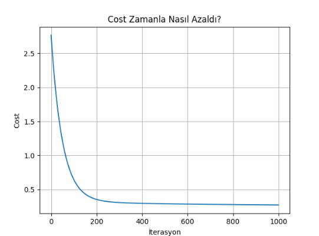
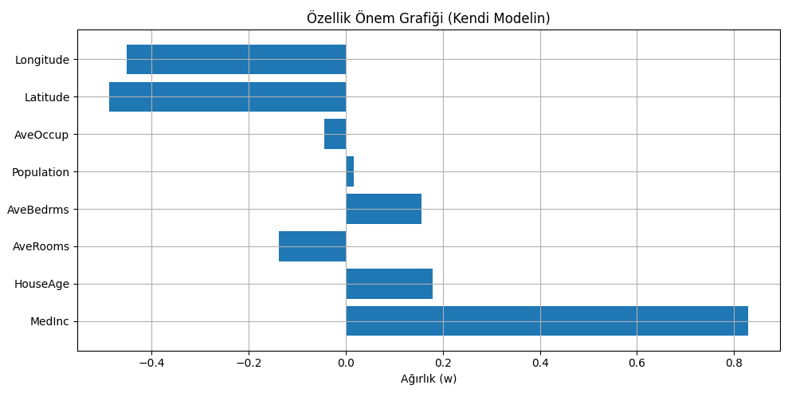

# 🧮 Multiple Linear Regression from Scratch (California Housing)

This project demonstrates how to build a multivariate linear regression model **from scratch**, focusing on the core math and optimization logic — not just using prebuilt libraries like `sklearn`.

---

## 🔍 Problem Definition

Using the California Housing dataset, we aim to predict a house’s median value based on 8 features:

- MedInc (Median Income)
- HouseAge (House Age)
- AveRooms (Average Rooms)
- AveBedrms (Average Bedrooms)
- Population
- AveOccup (Average Occupants)
- Latitude
- Longitude

---

## ⚙️ Techniques Used

- **Gradient Descent (Manual)**: Optimized weights and bias using iterative updates.
- **MSE (Mean Squared Error)** as the loss function.
- **Feature Normalization** for better convergence.
- **Model Saving**: Trained weights saved as `.npy` files.
- **Comparison with sklearn**: Benchmarked against `LinearRegression`.

---

## 🧪 Results

| Metric              | Custom Model  | `sklearn.LinearRegression` |
|---------------------|---------------|-----------------------------|
| R² Score            | 0.5672        | 0.5758                      |
| MAE (Mean Abs Error)| 0.55          | 0.53                        |

📉 The model’s cost function was also visualized over iterations.




---

## 📊 Feature Importance

The trained weights show how much each feature affects the predicted house value:

```python
plt.barh(feature_names, w)
plt.title("Feature Importance Chart")
```
The trained weights show how much each feature affects the predicted house value:

Features like `MedInc` and `HouseAge` had the most positive influence.

---

## 🗂️ Project Structure

```
├── main.py               # Training process
├── analyze.py            # Evaluation & visualization
├── california_housing.py # Data loading
├── gradient_descent.py   # Gradient descent algorithm
├── cost_function.py      # MSE cost function
├── model.py              # Prediction logic (w*x + b)
├── plots/                # Output plots
├── README.md             # This file
```

---

## 🚀 How to Run

```bash
pip install -r requirements.txt
python main.py         # Trains the model
python analyze.py      # Evaluates and visualizes results
```

---

## 🎯 Why This Project?

This wasn’t just an assignment — it was an effort to **internalize how regression really works**, to go beyond black-box modeling and build everything from the ground up.

---

## 🧠 What I Learned

- Understood gradient descent at a deep level  
- Learned how to benchmark models  
- Wrote and understood every line of code myself

---

## 📌 Note

This project is a great entry point for anyone trying to build a **real understanding** of linear regression and optimization techniques — not just plug-and-play usage.

---

## 📬 Contact

Feel free to reach out for feedback or collaboration:  
📧 elifceler55@gmail.com  
📍 GitHub: [github.com/elifceler](https://github.com/elifceler)
